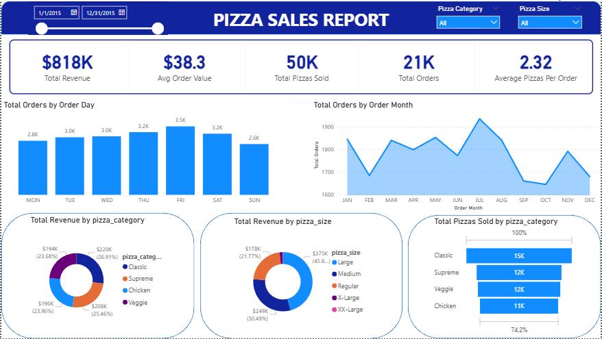

# Sales Performance Dashboard

## 📌 Project Overview
This project analyzes sales data to evaluate business performance using a complete data pipeline:
**data ingestion → storage → analysis → visualization**.

The goal is to transform raw sales data into meaningful insights using **SQL, Python, and Power BI**, following a structured and reproducible workflow.

The final result is an interactive **Power BI dashboard** that shows key performance indicators (KPIs), trends, and category-based analysis.

## 📷 Dashboard Preview

  

